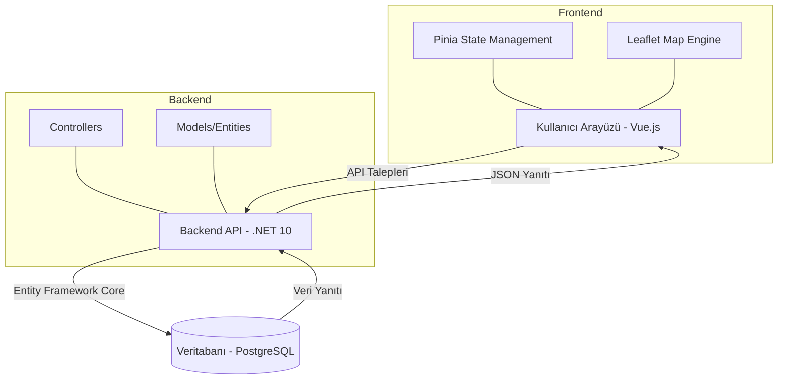

# IHA Takip ve Yönetim Sistemi

Bu proje, İnsansız Hava Araçlarını (İHA) takip etmek, uçuş rotalarını yönetmek ve havalimanı bilgilerini görüntülemek için geliştirilmiş tam kapsamlı (full-stack) bir web uygulamasıdır.

## Teknolojiler

### Backend
- **Framework:** .NET 10.0 (ASP.NET Core Web API)
- **Veritabanı:** PostgreSQL
- **ORM:** Entity Framework Core
- **Dokümantasyon:** Swagger / OpenAPI

### Frontend
- **Framework:** Vue.js 3 (Composition API)
- **Build Tool:** Vite
- **State Management:** Pinia
- **UI Component Library:** Vuetify
- **Harita:** Leaflet.js
- **HTTP Client:** Axios

---

## Proje Mimarisi

Proje, istemci-sunucu (client-server) modeline dayalı, modern bir mimari ile yapılandırılmıştır.

### Genel Akış
Uygulama, kullanıcı etkileşimlerini frontend üzerinden alır, Pinia store'ları aracılığıyla API taleplerini yönetir ve backend tarafında PostgreSQL veritabanı ile senkronize bir şekilde çalışır.



### Katmanlar
1.  **Frontend (İstemci):** `vue-project` klasörü altında yer alır. Harita görselleştirmesi için Leaflet, durum yönetimi için Pinia kullanılır.
2.  **Backend (Sunucu):** `IHA_Backend` klasörü altında yer alan RESTful API. İş mantığını ve veritabanı erişimini yönetir.
3.  **Veritabanı:** Verilerin kalıcı olarak saklandığı PostgreSQL katmanı.

---

## Kurulum ve Çalıştırma

Projeyi yerel ortamınızda çalıştırmak için aşağıdaki adımları takip edin.

### 1. Depoyu Klonlayın

```bash
git clone https://github.com/zenepvarol/vue-project.git
cd IHA_System
```

### 2. Veritabanını Hazırlayın

Proje PostgreSQL kullanmaktadır. Docker üzerinden hızlıca kurulumunu gerçekleştirebilirsiniz:

```bash
docker run --name iha-postgres -e POSTGRES_USER=zeynep -e POSTGRES_PASSWORD=123 -e POSTGRES_DB=IhaDb -p 5432:5432 -d postgres
```

> **Not:** `appsettings.json` içerisindeki bağlantı dizesi (Connection String) yukarıdaki bilgilerle uyumlu olmalıdır.

### 3. Backend'i Çalıştırın

```bash
cd IHA_Backend
dotnet restore
dotnet ef database update
dotnet run
```
Backend çalışmaya başladıktan sonra `http://localhost:5432/swagger` (veya yapılandırılmış port) üzerinden API dokümantasyonuna erişebilirsiniz.

### 4. Frontend'i Çalıştırın

```bash
cd ../vue-project
npm install
npm run dev
```
Uygulama varsayılan olarak `http://localhost:5173` adresinde çalışacaktır.

---

## Özellikler

- **Canlı İHA Takibi:** Harita üzerinde İHA'ların konumlarını ve hareketlerini anlık izleme.
- **Rota Yönetimi:** İHA'lar için kalkış ve varış noktaları belirleme.
- **Havalimanı Bilgileri:** Sistemde kayıtlı havalimanlarını görüntüleme.
- **Uçuş Geçmişi:** Tamamlanan uçuşların kayıtlarını tutma ve listeleme.
- **Modern Arayüz:** Vuetify ile hazırlanmış, kullanıcı dostu ve duyarlı (responsive) tasarım.

---

## Katkıda Bulunma

1. Bu depoyu fork edin.
2. Yeni bir özellik dalı (branch) oluşturun (`git checkout -b ozellik/yeniOzellik`).
3. Değişikliklerinizi kaydedin (`git commit -m 'Yeni özellik eklendi'`).
4. Dalınıza gönderin (`git push origin ozellik/yeniOzellik`).
5. Bir Çekme İsteği (Pull Request) açın.

---

## Lisans

Bu proje [MIT](LICENSE) lisansı ile lisanslanmıştır.
